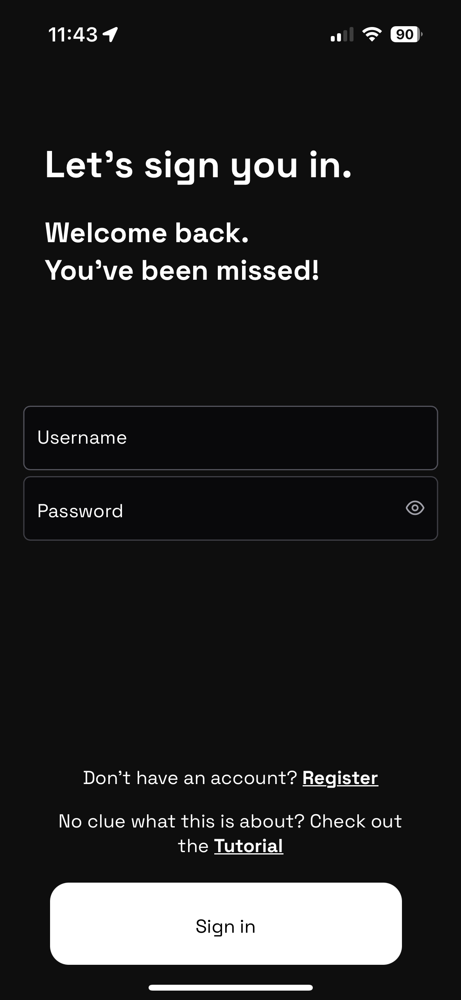
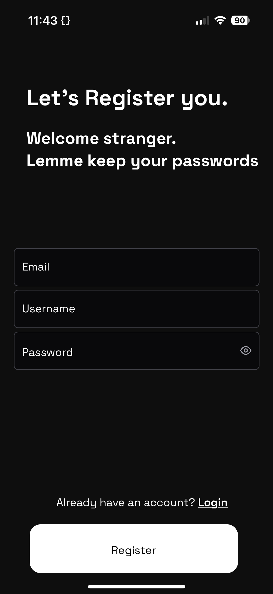
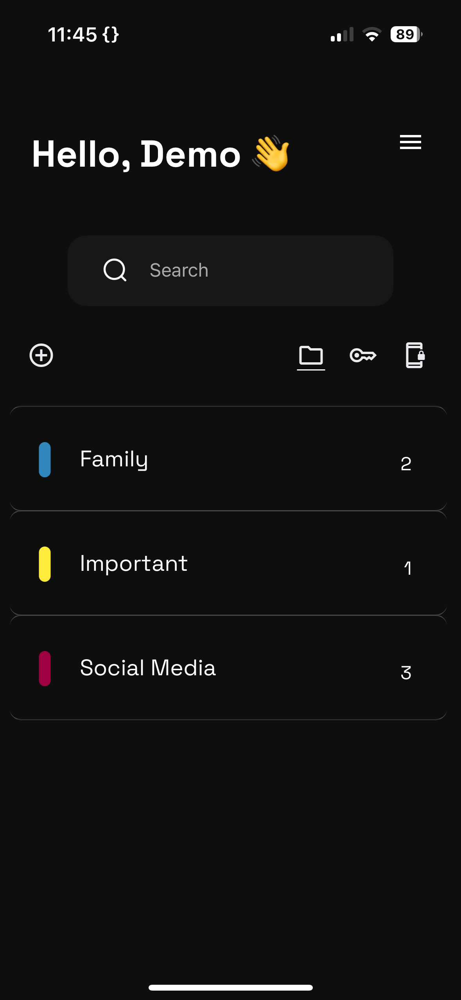
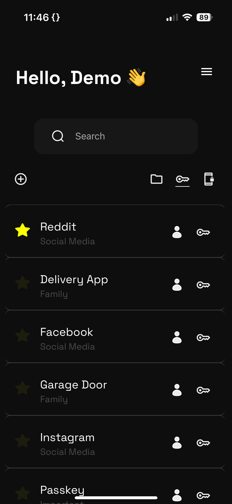
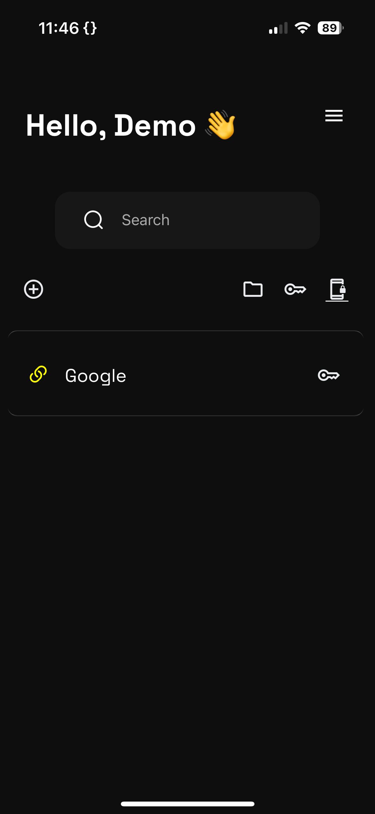
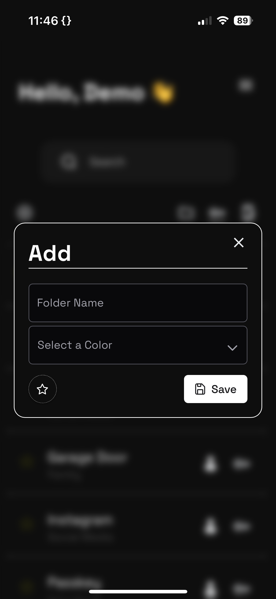
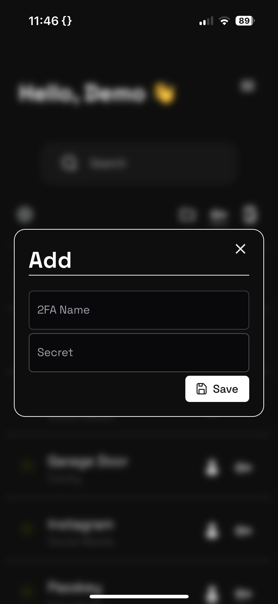
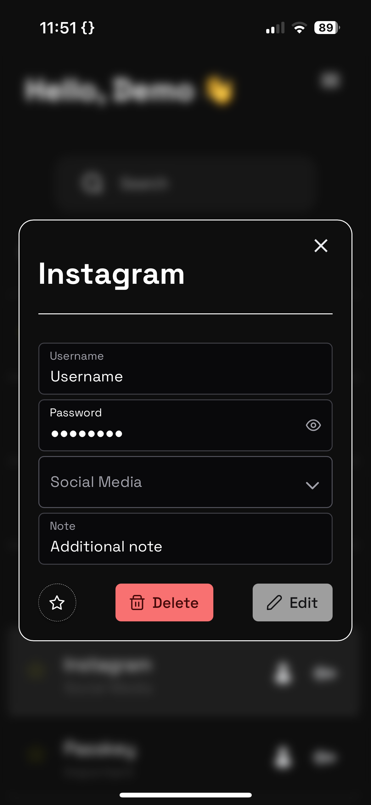

# P4ssword-M4nager

This project is a Password Manager designed to work on every Platform (Windows, Linux, Macos, Android, iOs, ...). It can be installed as PWA (**P**rogressive **W**eb **A**pp) or used directly in the browser. The Database is selfhosted and managed through an API. Everything is encrypted using the users password to ensure security even if the database gets leaked. 

## 🎭 Features

- Unrestricted User registrations
- Storing encrypted Login Credentials (Name, Username, Password, Note)
- Wrap the Credentials within Folders to sort them
- Adding 2FA Credentials to generate OTP Codes.
- Global Accessible Data
- Offline Modus
- Copy Username/Password/OTP-Code Directly into Clipboard without exposing it

## 🔱 Host locally

We added a `docker-compose` file on the root project to easyily set it up. Make sure you installed **Docker** and **docker-compose**.

### 1) Install Docker and Docker-Compose
```bash
sudo apt-get update
sudo apt-get install ca-certificates curl gnupg lsb-release
sudo mkdir -p /etc/apt/keyrings
curl -fsSL https://download.docker.com/linux/ubuntu/gpg | sudo gpg --dearmor -o /etc/apt/keyrings/docker.gpg
echo "deb [arch=$(dpkg --print-architecture) signed-by=/etc/apt/keyrings/docker.gpg] https://download.docker.com/linux/ubuntu $(lsb_release -cs) stable" | sudo tee /etc/apt/sources.list.d/docker.list > /dev/null
sudo apt-get update
sudo apt-get install docker-ce docker-ce-cli containerd.io docker-buildx-plugin docker-compose-plugin
```

### 2) Setup the .env Files

Copy over the `.env.example` and name it `.env`. Exchange the paramater described in the comments

```env
# LEAVE AS IS #
SQL_DATABASE_CLIENT=postgresql
SQL_USER=postgres
SQL_PASSWORD=postgres
SQL_URL=postgresdb
SQL_PORT=5432
SQL_DB_NAME=mydb

# TODO: Insert your local network ip with port :8000 #
VUE_APP_AXIOS_BASE_URL=http://192.168.1.17:8000/
```

### 3) Run it
If you are on Linux, execute the `run.sh` script and you are all setup.

```bash
./run.sh
```

If you are on Windows, you need to copy the `.env` file manually into the `/frontend`, `/backend` and root folder. Then simply run in the root directory the `docker-compose` command:

```bash
sudo docker-compose up --build --force-recreate --no-deps
```

### 4) Install PWA

PWAs can only be installed on Chrome (for Android and Desktop) and on Safari (for iOS). In Chrome, press the three dots and click on `Install App` or `Add to Home Screen`. In Safari you have to click the share button and then `Add to Home Screen`. Now you are all set up and ready to use the App.


## 📷 Screenshots
| Login | Register |
|----------|------------|
|||

| Home Folders | Home Passwords | Home 2FA | 
|----------|------------|------------|
||| |

| Add Folders | Add Passwords | Add 2FA | 
|----------|------------|------------|
||| |

| Folder Inspection | Password Inspection | Password Generator
|----------|------------|------------|
||||

